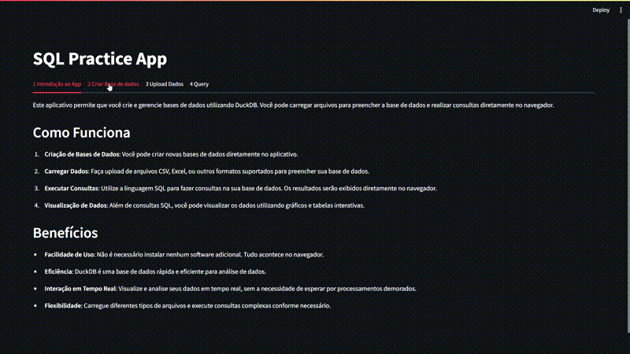

# Apresentação do Aplicativo de Análise de Dados streamlit-sql

Bem-vindo ao nosso aplicativo de Análise de Dados! Este aplicativo foi desenvolvido para facilitar a criação e análise de bases de dados utilizando DuckDB.

## Como Funciona

1. **Criação de Bases de Dados**: Você pode criar novas bases de dados diretamente no aplicativo.

2. **Carregar Dados**: Faça upload de arquivos CSV, Excel, ou outros formatos suportados para preencher sua base de dados.

3. **Executar Consultas**: Utilize a linguagem SQL para fazer consultas na sua base de dados. Os resultados serão exibidos diretamente no navegador.

4. **Visualização de Dados**: Além de consultas SQL, você pode visualizar os dados utilizando gráficos e tabelas interativas.

## Benefícios

- **Facilidade de Uso**: Não é necessário instalar nenhum software adicional. Tudo acontece no navegador.

- **Eficiência**: DuckDB é uma base de dados rápida e eficiente para análise de dados.

- **Interação em Tempo Real**: Visualize e analise seus dados em tempo real, sem a necessidade de esperar por processamentos demorados.

- **Flexibilidade**: Carregue diferentes tipos de arquivos e execute consultas complexas conforme necessário.

## Próximos Passos

Agora que você está familiarizado com nosso aplicativo, sinta-se à vontade para experimentá-lo! Faça o upload de seus dados, explore as funcionalidades de consulta e análise, e descubra novos insights a partir de suas informações.

Agradecemos por escolher nosso aplicativo de Análise de Dados. Se tiver alguma dúvida ou feedback, não hesite em nos contatar.

Divirta-se analisando seus dados!
